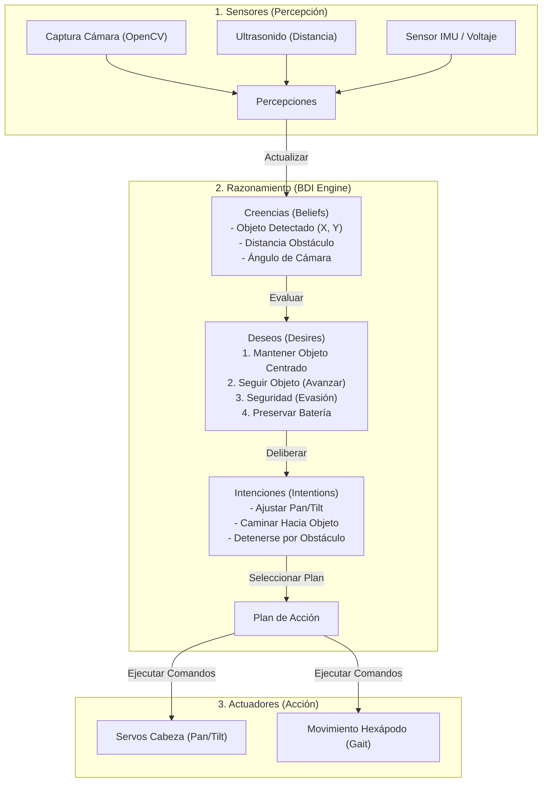

# Estrategia: Enfoque de Programación Basado en Agentes (BDI) para el Seguimiento de Objetos

Este documento describe cómo estructurar el software del robot hexápodo bajo un **Enfoque de Programación Basado en Agentes**, específicamente utilizando el modelo **BDI (Belief-Desire-Intention / Creencia-Deseo-Intención)** para lograr que el robot utilice su cámara integrada y siga un objeto de forma autónoma.

---

## 1. Introducción al Modelo BDI en Robótica

El modelo BDI es un patrón de arquitectura cognitiva para agentes de software inteligentes. En lugar de utilizar programación puramente reactiva (basada en simples condicionales `if/else`), el agente modela su comportamiento imitando la toma de decisiones humana:

*   **Creencias (Beliefs):** Representan el conocimiento del agente sobre sí mismo y sobre su entorno. Son informaciones obtenidas a través de sensores y percepciones que el agente da por verdaderas en el instante actual.
*   **Deseos (Desires):** Representan los estados u objetivos que al agente le gustaría alcanzar. Los deseos pueden entrar en conflicto o tener prioridades jerárquicas (por ejemplo, "seguir el objeto" frente a "evitar chocar").
*   **Intenciones (Intentions):** Representan los deseos que el agente ha elegido ejecutar activamente. Para cumplir una intención, el agente selecciona y ejecuta un **plan de acción** concreto.

---

## 2. El Ciclo de Razonamiento del Agente (Sense-Reason-Act)

El agente opera en un bucle continuo compuesto por tres fases fundamentales:



---

## 3. Definición de BDI para el Seguimiento de Objetos

Para que el hexápodo siga un objeto (como una pelota de color o un rostro) usando la cámara, definimos los componentes BDI de la siguiente manera:

### A. Creencias (Beliefs)
Las creencias se actualizan recursivamente en cada cuadro capturado por la cámara y lecturas de sensores:
1.  `target_detected`: Booleano que indica si el objeto objetivo es visible en el cuadro actual.
2.  `target_coordinates`: Tupla `(x, y)` que indica la posición del centro del objeto en el plano de la imagen relativo al centro de la cámara (rango `-1.0` a `1.0`).
3.  `target_size`: Área relativa que ocupa el objeto (utilizado para estimar la distancia relativa al objeto).
4.  `obstacle_distance`: Distancia leída por el sensor ultrasónico HC-SR04.
5.  `camera_angles`: Ángulos actuales de los servos de Pan y Tilt de la cabeza `(pan_angle, tilt_angle)`.
6.  `battery_low`: Indica si el voltaje del robot está por debajo de los límites seguros.

### B. Deseos (Desires)
Los objetivos del robot, ordenados de mayor a menor prioridad:
1.  **D_SAFETY (Seguridad):** No chocar contra obstáculos físicos y evitar que se agote la batería.
2.  **D_CENTER (Centrar Objetivo):** Mantener el objeto objetivo en el centro del campo de visión de la cámara.
3.  **D_TRACK (Seguimiento):** Mantenerse a una distancia constante y óptima del objeto (avanzar si está lejos, retroceder si está muy cerca).
4.  **D_WANDER (Búsqueda):** Si no se detecta el objetivo, explorar el entorno rotando el chasis o la cámara para encontrarlo.

### C. Intenciones e Planes (Intentions & Plans)
El motor de deliberación evalúa las creencias actuales y activa intenciones que se traducen en planes:
*   **Intención: Evasión de Obstáculos**
    *   *Gatillo:* Creencia `obstacle_distance < 30 cm`.
    *   *Plan:* Ignorar temporalmente el seguimiento del objeto, detener la marcha hacia adelante y retroceder o girar a la izquierda.
*   **Intención: Centrar Cámara**
    *   *Gatillo:* Creencia `target_detected == True` y `abs(target_coordinates_x) > 0.1` o `abs(target_coordinates_y) > 0.1`.
    *   *Plan:* Ajustar los ángulos de Pan y Tilt de la cámara mediante el envío de comandos `CMD_CAMERA` de manera proporcional al error de distancia al centro.
*   **Intención: Acercarse / Alejarse del Objetivo**
    *   *Gatillo:* Creencia `target_detected == True` y `target_size` fuera de los límites deseados.
    *   *Plan:* Enviar comandos de locomoción `CMD_MOVE` para avanzar o retroceder proporcionalmente al tamaño del objeto.
*   **Intención: Buscar Objetivo**
    *   *Gatillo:* Creencia `target_detected == False`.
    *   *Plan:* Ejecutar una secuencia de barrido visual moviendo el servo de Pan de izquierda a derecha. Si el barrido no arroja resultados, girar lentamente el chasis del hexápodo.

---

## 4. Implementación Conceptual del Motor BDI en Python

A continuación se muestra un diseño conceptual de cómo estructurar esta lógica en el robot utilizando una clase de agente que interactúa con las APIs existentes de [server.py](Code/Server/server.py):

```python
import time
import cv2
import numpy as np

class BDIHexapodAgent:
    def __init__(self, server_interface):
        self.robot = server_interface  # Conexión directa a los componentes de control y sensores
        
        # 1. Base de Creencias (Beliefs)
        self.beliefs = {
            "target_detected": False,
            "target_x": 0.0,      # Rango -1.0 a 1.0 (error horizontal)
            "target_y": 0.0,      # Rango -1.0 a 1.0 (error vertical)
            "target_area": 0.0,   # Proporción del cuadro que ocupa
            "obstacle_distance": 100.0,  # en cm
            "pan_angle": 90,
            "tilt_angle": 90
        }
        
        # Parámetros del controlador PID para suavizado de cámara
        self.pan_pid = (0.5, 0.0, 0.05) 
        
    def perception_loop(self):
        """Fase SENSE: Actualiza las creencias leyendo sensores y la cámara."""
        # A. Procesar cuadro de la cámara (visión por computadora)
        frame = self.robot.camera_device.get_frame()
        detected, x, y, area = self.detect_object(frame)
        
        self.beliefs["target_detected"] = detected
        self.beliefs["target_x"] = x
        self.beliefs["target_y"] = y
        self.beliefs["target_area"] = area
        
        # B. Leer sensores físicos
        self.beliefs["obstacle_distance"] = self.robot.ultrasonic_sensor.get_distance()
        
    def detect_object(self, frame):
        """Función auxiliar para segmentación de color u objeto con OpenCV."""
        # Código para detectar, por ejemplo, una pelota de color o rostro
        # Retorna: (detected_bool, center_x, center_y, area)
        return False, 0.0, 0.0, 0.0

    def deliberate(self):
        """Fase REASON: Determina las intenciones basadas en las creencias."""
        intentions = []
        
        # Regla 1: La seguridad es prioritaria (Evasión de colisiones)
        if self.beliefs["obstacle_distance"] < 25.0:
            intentions.append("AVOID_OBSTACLE")
            return intentions  # Detiene otras intenciones de movimiento hacia adelante
            
        # Regla 2: Centrar y seguir si el objeto está visible
        if self.beliefs["target_detected"]:
            intentions.append("CENTER_CAMERA")
            
            # Decidir si avanzar, detenerse o retroceder
            if self.beliefs["target_area"] < 0.05:  # El objeto está lejos
                intentions.append("APPROACH_TARGET")
            elif self.beliefs["target_area"] > 0.20: # El objeto está muy cerca
                intentions.append("RETREAT_FROM_TARGET")
            else:
                intentions.append("STAND_STILL")
        else:
            # Regla 3: Si no se ve, buscar
            intentions.append("SEARCH_FOR_TARGET")
            
        return intentions

    def execute_plans(self, intentions):
        """Fase ACT: Ejecuta planes para cumplir las intenciones elegidas."""
        for intention in intentions:
            if intention == "AVOID_OBSTACLE":
                # Plan: Detenerse y retroceder
                self.robot.control_system.command_queue = ["CMD_MOVE", "1", "0", "-20", "8", "0"]
                
            elif intention == "CENTER_CAMERA":
                # Plan: Mover los servos de la cámara proporcionalmente al error
                error_x = self.beliefs["target_x"]
                error_y = self.beliefs["target_y"]
                
                # Modificar ángulos de Pan y Tilt
                self.beliefs["pan_angle"] -= int(error_x * 15)  # Ganancia proporcional
                self.beliefs["tilt_angle"] += int(error_y * 15)
                
                # Restringir ángulos a límites físicos
                self.beliefs["pan_angle"] = max(50, min(180, self.beliefs["pan_angle"]))
                self.beliefs["tilt_angle"] = max(0, min(180, self.beliefs["tilt_angle"]))
                
                # Aplicar movimiento físico
                self.robot.servo_controller.set_servo_angle(0, self.beliefs["pan_angle"])
                self.robot.servo_controller.set_servo_angle(1, self.beliefs["tilt_angle"])
                
            elif intention == "APPROACH_TARGET":
                # Plan: Caminar hacia adelante y orientar el chasis hacia el ángulo de Pan
                pan_offset = self.beliefs["pan_angle"] - 90
                # Si el servo apunta muy a la derecha/izquierda, girar el chasis
                yaw_chassis = int(pan_offset * 0.2)
                self.robot.control_system.command_queue = ["CMD_MOVE", "1", "0", "20", "6", str(yaw_chassis)]
                
            elif intention == "RETREAT_FROM_TARGET":
                # Plan: Caminar hacia atrás
                self.robot.control_system.command_queue = ["CMD_MOVE", "1", "0", "-15", "6", "0"]
                
            elif intention == "STAND_STILL":
                # Plan: Detener marcha de las patas
                self.robot.control_system.command_queue = ["CMD_MOVE", "1", "0", "0", "6", "0"]
                
            elif intention == "SEARCH_FOR_TARGET":
                # Plan: Hacer barrido con la cabeza para re-localizar el objeto
                sweep_angle = int(90 + 45 * np.sin(time.time() * 2))
                self.robot.servo_controller.set_servo_angle(0, sweep_angle)

    def run(self):
        """Bucle principal de ejecución del agente."""
        while True:
            self.perception_loop()
            intentions = self.deliberate()
            self.execute_plans(intentions)
            time.sleep(0.05)  # Frecuencia de ciclo cognitivo a 20Hz
```

---

## 5. Beneficios de esta Estrategia

1.  **Robustez:** El robot reacciona de forma segura ante obstáculos imprevistos incluso si está sumamente concentrado en seguir el objeto.
2.  **Desacoplamiento:** La lógica de "qué quiere hacer el robot" (deliberación cognitiva) está completamente separada del control motor cinemático subyacente ([control.py](Code/Server/control.py)) y de la lógica de transmisión de red.
3.  **Modularidad:** Es sencillo añadir nuevos sensores o deseos (como por ejemplo "retornar a la base de carga si `battery_low` es verdadero") simplemente actualizando las bases de creencias y prioridades de deseos.
