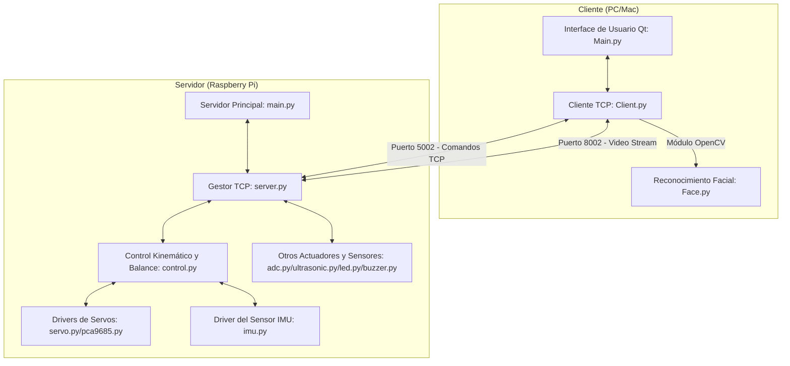

# Guía de Funcionamiento del Robot Hexápodo Freenove

Esta guía detalla la arquitectura de software, hardware, protocolos de comunicación y el funcionamiento general del kit de Robot Hexápodo Grande de Freenove para Raspberry Pi.

---

## 1. Arquitectura General del Sistema

El sistema opera bajo un modelo de arquitectura **Cliente-Servidor** que se comunica a través de una red de datos TCP/IP (generalmente vía Wi-Fi).



### Roles de los Componentes
*   **Servidor (Raspberry Pi):** Se ejecuta localmente en el robot. Escucha las conexiones entrantes, procesa los comandos de control cinemático, lee los sensores locales (voltaje de baterías, giroscopio/acelerómetro, distancia ultrasónica) y controla los actuadores (servos de las patas, zumbador, tira de LEDs de colores, servomotores de la cámara/cabeza). Además, transmite video en tiempo real desde la cámara.
*   **Cliente (PC/Mac/Linux):** Proporciona una interfaz gráfica de usuario (GUI) desarrollada con PyQt5 que permite al usuario controlar los movimientos del robot en tiempo real, visualizar la transmisión de video en vivo de la cámara y ejecutar tareas como el reconocimiento facial por OpenCV.

### Puertos de Red
*   **Puerto de Comandos (`5002`):** Canal de comunicación TCP bidireccional por el cual el cliente envía comandos formateados como strings y el servidor devuelve lecturas de sensores (voltaje, distancia).
*   **Puerto de Video (`8002`):** Canal TCP dedicado a la transmisión de secuencias de fotogramas JPEG empaquetados directamente desde la cámara del Raspberry Pi.

---

## 2. Estructura de Directorios y Archivos de Código

El software se divide principalmente en el código que se ejecuta en el robot (Servidor) y el que se ejecuta en la estación de control (Cliente):

### Servidor (Raspberry Pi) - Ubicado en `Code/Server/`
*   [main.py](Code/Server/main.py): Punto de entrada principal en la Raspberry Pi. Inicia la aplicación (con o sin interfaz gráfica Qt según los parámetros `-n` y `-t`).
*   [server.py](Code/Server/server.py): Controla la lógica de red TCP. Acepta las conexiones de comandos y video, recibe los mensajes de texto, los decodifica y despacha las acciones correspondientes a los sensores y al sistema de control cinemático.
*   [control.py](Code/Server/control.py): El núcleo lógico de la locomoción del hexápodo. Contiene las matrices de rotación, la cinemática inversa y directa para las 6 patas, la lógica de balance automático mediante el IMU y las secuencias de marcha (Gaits).
*   [servo.py](Code/Server/servo.py): Traduce ángulos físicos en grados a ciclos de trabajo PWM de los controladores PCA9685 y maneja la desactivación (relax) de los servomotores.
*   [pca9685.py](Code/Server/pca9685.py): Driver de bajo nivel para comunicarse por el bus I2C con los chips generadores de PWM PCA9685.
*   [imu.py](Code/Server/imu.py): Driver para el sensor MPU6050. Calcula los ángulos de Pitch (cabeceo), Roll (alabeo) y Yaw (guiñada) combinando acelerómetro y giroscopio usando filtros de Kalman y algoritmos de actitud quaternion.
*   [adc.py](Code/Server/adc.py): Lee el chip ADS7830 a través de I2C para monitorizar el voltaje de la batería de carga y la batería del Raspberry Pi.
*   [ultrasonic.py](Code/Server/ultrasonic.py): Utiliza la librería `gpiozero` para medir distancias mediante el sensor ultrasónico HC-SR04 conectado a GPIO.
*   [led.py](Code/Server/led.py): Controla la tira de LED direccionables WS281X. Soporta animaciones (arcoíris, respiración, destellos, persecución) y cambia dinámicamente según la versión del PCB (v1 usa WS281X directo, v2 usa SPI LedPixel).
*   [buzzer.py](Code/Server/buzzer.py): Controla el zumbador piezoeléctrico activo (activación/desactivación por GPIO).
*   [command.py](Code/Server/command.py): Define las constantes de cadenas de comandos del protocolo de comunicación.

### Cliente (Computadora de Control) - Ubicado en `Code/Client/`
*   [Main.py](Code/Client/Main.py): Punto de inicio de la aplicación de escritorio del cliente. Inicializa la interfaz gráfica, procesa las pulsaciones de teclas del teclado para mover el robot y gestiona los hilos de recepción.
*   [Client.py](Code/Client/Client.py): Administra la conexión de red TCP del lado del cliente, recibe el flujo de datos del video y decodifica las imágenes JPEG.
*   [Face.py](Code/Client/Face.py): Módulo para el procesamiento de imágenes usando OpenCV. Implementa detección de rostros con clasificadores Haar Cascade y reconocimiento facial basado en el algoritmo Local Binary Patterns Histograms (LBPH).
*   [Calibration.py](Code/Client/Calibration.py): Interfaz gráfica independiente para calibrar la posición neutral de las patas del hexápodo y guardar la configuración en `point.txt`.

---

## 3. Funcionamiento de la Cinemática y el Movimiento

La locomoción de un robot hexápodo de 18 grados de libertad (3 articulaciones por pata × 6 patas) requiere cálculos geométricos complejos controlados en [control.py](Code/Server/control.py):

### Cinemática Inversa (IK)
El método `coordinate_to_angle(x, y, z)` calcula los tres ángulos de articulación (Coxa, Femur, Tibia) requeridos para colocar la punta de la pata (efector final) en una coordenada específica $(x, y, z)$ relativa a la articulación base:
*   **Coxa ($a$):** Determina la rotación en el plano horizontal (Yaw).
*   **Femur ($b$):** Controla el ángulo de elevación de la articulación intermedia.
*   **Tibia ($c$):** Ajusta la extensión de la parte final de la pata.

La fórmula aplica trigonometría y ley de cosenos usando las longitudes físicas de los eslabones (por defecto: $l_1=33\text{ mm}$, $l_2=90\text{ mm}$, $l_3=110\text{ mm}$).

### Estabilización y Balance Autónomo (IMU + PID)
Cuando la función de balance automático está habilitada (`CMD_BALANCE#1`), el servidor ejecuta un hilo continuo `imu6050()`:
1.  Lee continuamente los valores de aceleración y velocidad angular del sensor MPU6050 ([imu.py](Code/Server/imu.py)).
2.  Calcula los ángulos de actitud del chasis en tiempo real (Pitch y Roll).
3.  Alimenta estos ángulos a un controlador PID incremental (`Incremental_PID` de [pid.py](Code/Server/pid.py)).
4.  Calcula una matriz de rotación 3D en `calculate_posture_balance(roll, pitch, yaw)`.
5.  Desplaza las coordenadas objetivo de los extremos de las patas en dirección opuesta a la inclinación detectada, manteniendo el chasis del robot completamente horizontal a pesar de que el terreno esté inclinado.

### Patrones de Marcha (Gaits)
El robot implementa dos tipos de marcha en la función `run_gait(data)`:
1.  **Gait Modo 1 (Tripod / Trípode):** Las patas se dividen en dos grupos alternos de tres (patas 1-3-5 y patas 2-4-6). Mientras un grupo se apoya en el suelo y empuja hacia atrás para avanzar el cuerpo, el otro grupo se levanta y avanza en el aire. Es una marcha rápida y muy estable.
2.  **Gait Modo 2 (Ripple / Onda):** Las patas se levantan de forma secuencial una a una (o en un patrón ondulante ordenado). Es más lenta pero maximiza el número de puntos de apoyo en todo momento (5 de las 6 patas en el suelo), ideal para terrenos difíciles.

---

## 4. Hardware y Sensores de Abordo

El circuito de hardware del hexápodo integra varios componentes conectados a los pines del Raspberry Pi:

*   **Controladores PWM (PCA9685):** Se comunican mediante I2C (direcciones `0x40` y `0x41`). Cada chip ofrece 16 canales PWM. Los servos se distribuyen entre ambos chips: los canales 0-15 se gestionan en el bus a través de la dirección `0x41` y del 16-31 en `0x40`.
*   **Sensor Ultrasónico (HC-SR04):** Conectado al pin GPIO 27 (Trigger) y GPIO 22 (Echo) del Raspberry Pi. Permite medir la distancia a obstáculos frontales para implementar evasión automática.
*   **Monitoreo de Voltaje (ADS7830):** Conversor analógico-digital de 8 canales por I2C (dirección `0x48`). Lee el voltaje de las baterías en los canales 0 y 4. Si el voltaje detectado disminuye por debajo de los límites seguros (5.5V o 6.0V), el robot hace sonar el zumbador repetidamente como alarma de batería baja.
*   **Zumbador Piezoeléctrico (Buzzer):** Conectado al pin GPIO 17. Se utiliza para emitir alertas sonoras.
*   **Iluminación LED:** Utiliza una tira de 7 píxeles LED direccionables. Dependiendo de la versión del hardware:
    *   **PCB V1.0 + Pi 4/3:** Control directo a través del pin GPIO PWM (usa librería `rpi_ws281x`).
    *   **PCB V2.0 + Pi 5/4/3:** Control por bus SPI (`spi_ledpixel.py`), ya que el soporte PWM en Pi 5 difiere.
*   **Servos de Cámara / Cabeza:** Los canales 0 y 1 de servomotores se usan para rotar la cámara horizontal (Pan) y verticalmente (Tilt).

---

## 5. Resumen del Protocolo de Comunicación

Los comandos enviados por TCP desde el cliente al servidor siguen el formato `<COMANDO>#<Parámetro1>#<Parámetro2>#...#\n`. Los principales comandos soportados son:

| Comando | Formato | Descripción |
| :--- | :--- | :--- |
| **Movimiento** | `CMD_MOVE#<mode>#<x>#<y>#<speed>#<angle>\n` | Mueve el robot. `mode` puede ser 1 (Trípode) o 2 (Ripple). `x`/`y` regulan la longitud del paso (-35 a 35). `speed` es la velocidad (2 a 10). `angle` la rotación (-10 a 10). |
| **Luces LED** | `CMD_LED_MOD#<mode>\n` | Cambia el modo de animación de los LEDs (0: apagado, 1: fijo, 2: persecución, 3: parpadeo, 4: arcoíris, 5: ciclo arcoíris). |
| **Color LED** | `CMD_LED#<R>#<G>#<B>\n` | Define el color fijo (R, G, B de 0 a 255) para los modos correspondientes. |
| **Ultrasonido** | `CMD_SONIC\n` | Solicita medición de distancia al sensor frontal. El servidor responde con la distancia en centímetros. |
| **Zumbador** | `CMD_BUZZER#<state>\n` | Enciende (`1`) o apaga (`0`) el zumbador de a bordo. |
| **Balance** | `CMD_BALANCE#<state>\n` | Activa (`1`) o desactiva (`0`) la función de auto-balance continuo usando el IMU MPU6050. |
| **Rotación de Cámara** | `CMD_CAMERA#<x>#<y>\n` | Mueve los servos de Pan y Tilt de la cabeza/cámara (ángulos de -90 a 90). |
| **Voltaje Batería** | `CMD_POWER\n` | Solicita la lectura de las baterías. Retorna `CMD_POWER#<V_motores>#<V_rpi>\n`. |
| **Servos Relax** | `CMD_SERVOPOWER#<state>\n` | Enciende o apaga la alimentación lógica/potencia de los servos para permitir moverlos manualmente sin resistencia. |

---

## 6. Procedimiento de Configuración Inicial y Ejecución

1.  **Instalación del Software en la Raspberry Pi:**
    *   Ejecutar el script [setup.py](Code/setup.py) con privilegios de administrador para instalar dependencias del sistema y configurar interfaces I2C, SPI y cámara en `/boot/firmware/config.txt`.
        ```bash
        sudo python3 setup.py
        ```
    *   Reiniciar el dispositivo.

2.  **Ejecutar el Servidor:**
    *   Se puede ejecutar el script principal del servidor en modo sin interfaz gráfica (`-n`) habilitando el canal TCP (`-t`):
        ```bash
        sudo python3 main.py -t -n
        ```

3.  **Ejecutar el Cliente en una PC/Mac:**
    *   Instalar las librerías necesarias con [setup_windows.py](Code/setup_windows.py) o [setup_macos.py](Code/setup_macos.py).
    *   Ejecutar la interfaz gráfica del cliente:
        ```bash
        python3 Main.py
        ```
    *   Ingresar la dirección IP de la Raspberry Pi en la interfaz gráfica para conectar.
